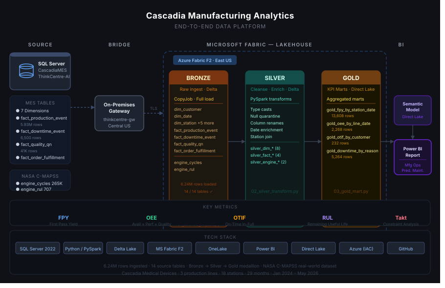

Cascadia is a portfolio of end-to-end analytics work — building the data systems, and leading how organizations run on them. The pieces don't share one architecture; they share a standard. Each uses the tools that fit its problem and its scale, from a full enterprise Microsoft BI stack to a few hundred lines of Python to a BI-platform migration program. What stays constant: dimensional modeling done properly, data governance that is honest about what the source does and doesn't say, and reporting a non-technical audience can actually act on.

---

## The Builds & Their Stacks

| Domain | Status | Stack | Data | Headline Skill |
|---|---|---|---|---|
| [Cascadia Control Tower](projects/cascadia-controltower.qmd) | Live | Python → DuckDB → dbt Core → static ECharts | Synthetic (seeded generator), anchored to BLS, Census and SEC XBRL | Metric certification / counterfactual costing |
| [Cascadia Deal Desk](projects/cascadia-dealdesk.qmd) | Live | Python → SQLite → static ECharts | Synthetic (seeded generator) | Pricing governance / exception calibration |
| [Cascadia Finance](projects/cascadia-finance.qmd) | Live | Python → SQLite → static ECharts (SEC EDGAR XBRL) | FormFactor SEC filings (real) | Financial analytics / XBRL governance |
| [Cascadia Staffing](projects/cascadia-staffing.qmd) | Complete | Local SQL Server → Power BI | CMS PBJ Daily Nurse Staffing (real) | Marketplace labor KPIs / metric governance |
| [Cascadia Pharmacy](projects/cascadia-pharmacy.qmd) | Complete | Local SQL Server → Power BI | CMS Part D + CDC VaxView (real) | Messy-data cleaning / GLP-1 growth |
| [Cascadia Medical Devices](projects/cascadia-medical-devices.qmd) | Complete | SQL Server → Microsoft Fabric → Power BI | Simulated MES + NASA C-MAPSS | Predictive maintenance / OEE |
| [Cascadia Clothing](projects/cascadia-clothing.qmd) | Planned | TBD | TBD e-commerce data | Customer segmentation |

> **Beyond the builds:** [Cascadia BI Migration](projects/cascadia-bi-migration.qmd) — a program design for migrating an organization off legacy BI onto a governed, AI-assisted platform, with a certified metric layer at the center. Analytics leadership, not just a data build.

> **Not a build at all:** [The Combinatorics of Sibling Conflict](projects/sibling-conflict.qmd) — a short mathematics paper, and a pet project. No stack, no data, nothing to put in the columns above. It counts the ways n children can split into two opposing sides: (3^n^ − 2·2^n^ + 1)/2, the Stirling number S(n+1, 3).

---

## Three Patterns, One Standard

**Lightweight analytical stack — Cascadia Deal Desk, Finance & Control Tower.**
Three modules that need neither SQL Server nor Power BI: Python (pandas) conforms the data into a local star schema and renders a static, hostable page with Apache ECharts, with the dataset inlined at build time so the pages make no network call at all. Finance pulls and freezes SEC EDGAR XBRL filings and labels every figure GAAP vs non-GAAP; Deal Desk matches quote lines against a governed agreement register and prices the gap in dollars; Control Tower certifies one of three competing fill-rate definitions and prices the split-shipment cost that none of them measures. They all run forever, offline, for free — and circulate as a link with nothing to install.

Control Tower is the pattern's larger variant: the warehouse is **DuckDB** rather than SQLite, and the transformation layer is **dbt Core** — 6 staging views, 9 marts and 69 data tests — because at 621,942 order lines the modeling is worth a real transformation framework and the tests are worth running on every build. The output is the same durable static page, which survives the warehouse being switched off.

**Pragmatic local stack — Cascadia Pharmacy & Staffing.**
For personal-scale builds on public data, a full cloud lakehouse is overkill. These run a local SQL Server star schema with a Python `raw → clean` staging layer — suppression flags, never zero-fill — straight into a Power BI import model. Same modeling and governance discipline, without the cloud overhead.

**Enterprise-BI stack — Cascadia Medical Devices.**
The full production pattern: a SQL Server star schema feeding a Microsoft Fabric medallion lakehouse (Bronze → Silver → Gold), surfaced through a Power BI Direct Lake semantic model. This is the pattern for when the data volume and the organization justify a governed cloud platform.

::: {.arch-container}

:::

---

## Design Principles

::: {.grid}
::: {.g-col-12 .g-col-md-6}
**Production patterns only**
Every table, index, and pipeline uses conventions you would enforce on a real production system — surrogate keys, computed `date_key` columns, idempotent builds, and row-count validation scripts.
:::
::: {.g-col-12 .g-col-md-6}
**Real data where it matters**
CMS, CDC, and SEC EDGAR are live, public-domain federal datasets. Fabricated data is limited to the manufacturing simulation layer, purely for volume and anonymity.
:::
::: {.g-col-12 .g-col-md-6}
**Repeatable builds**
Each domain rebuilds from scratch with one command — PowerShell for the SQL Server builds, Python for the Cascadia Finance module — useful for demos, onboarding, and validating changes.
:::
::: {.g-col-12 .g-col-md-6}
**Honest about limits**
Suppressed or missing data is flagged, never silently filled. GAAP is labeled distinctly from non-GAAP. Derived values (like reconstructed fiscal quarters) are marked as derived.
:::
::: {.g-col-12 .g-col-md-6}
**Ambiguity fails the build**
Where a rule cannot resolve a case, the run stops rather than guessing. Cascadia Deal Desk's matching rule settles contested quote lines with three documented tiebreaks; if a tie survives all three, the build fails — an unresolvable tie is a data-quality defect, not a judgment call.
:::
::: {.g-col-12 .g-col-md-6}
**Definitions live with the code that computes them**
A metric register that is typed by hand is documentation; one generated from the models is engineering. Cascadia Control Tower's eleven-metric register is built from the `meta` blocks on the dbt models themselves — the same file that defines their tests — and a `--check` mode fails the build if a published definition drifts from the model behind it.
:::
::: {.g-col-12 .g-col-md-6}
**An audit that cannot fail is not an audit**
A realism check that has only ever seen good data has not been tested. Control Tower's audits are pure functions of measured numbers, so the suite feeds each one deliberately wrong values — inventory inflated past the sector band, cost cut to a rounding error, splits made uniform — and confirms it trips. All six negative controls trip, and that result is published next to the real one.
:::
::: {.g-col-12 .g-col-md-6}
**Charts reviewed against a standard**
Every chart is scored pass/fail against my visualization design system before it ships, including a blind panel of readers who see only the rendered chart. Titles that claimed a figure the reader could not verify from the plot were rebuilt rather than re-worded.
:::
:::

---

## Tech Stack

Python (pandas)
SQLite
DuckDB
dbt Core
Apache ECharts
SEC EDGAR XBRL
SQL Server 2025
T-SQL
Power BI
DAX
Microsoft Fabric
PySpark
Static HTML / JS
WCAG 2.2 AA
GitHub Pages
PowerShell
Git

