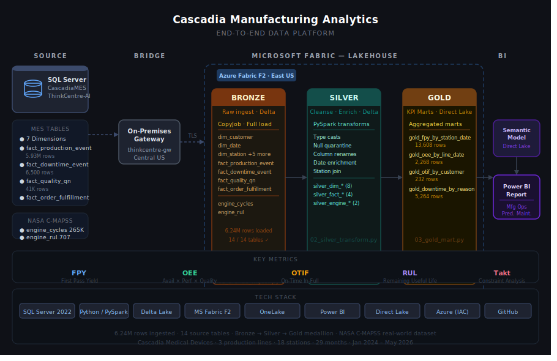

::: {.case-study-header}
::: {.cs-domain}
Healthcare / Pharmacy Analytics
:::
# Cascadia Pharmacy
::: {.cs-hook}
Turning messy federal public data — CMS Part D suppressed cells, CDC VaxView age-band mismatches — into a clean star schema and an interview-ready GLP-1 growth story.
:::
:::

---

## Overview

<!-- TODO (Cowork): 2–3 sentence overview. -->
::: {.todo-block}
**TODO (Cowork — Overview):** 2–3 sentences: pharmacy analytics domain (CVS-relevant), the business question (GLP-1 cost trajectory + immunization access disparities), and the headline skill (messy public-data cleaning + SQL Server star schema applied to real CMS/CDC data).
:::

---

## Business Problem

<!-- TODO (Cowork): CVS-framed business problem. -->
::: {.todo-block}
**TODO (Cowork — Business Problem):** Frame through a CVS lens: Medicare Part D drug spend trends (especially GLP-1s / obesity drugs) and adult immunization coverage gaps matter directly to a pharmacy chain's formulary strategy and immunization programs. What would a CVS analytics leader want to answer from this data? (E.g., "Which drugs drove the largest spend increases? Which states have the lowest flu vaccination rates?")
:::

---

## Architecture

::: {.arch-container}

:::

**Source layer:** CascadiaRx SQL Server star schema — 5 dimension tables + 2 fact tables.

- `fact_partd_drug_spend` (339 rows, grain: drug × year 2020–2024, CMS Part D data)
- `fact_immunization_coverage` (24,596 rows, grain: vaccine × geography × demographic × season, CDC VaxView)

**Medallion pipeline:** Bronze → Silver → Gold notebooks in Microsoft Fabric Lakehouse (Phase 2, in build).

**Semantic model + report:** Power BI — GLP-1 Growth Story page + Immunization Coverage & Access page (Phase 2, in build).

---

## Data Sources

| Source | Type | Rows | Notes |
|---|---|---|---|
| CMS Medicare Part D Spending by Drug | Federal (CMS) | 14,536 raw → 339 filtered | Wide-format CSV, 2020–2024 annual columns; filtered to antidiabetic/obesity drug classes |
| CDC FluVaxView | Federal (CDC / Socrata) | 100K raw → 24,596 filtered | Adult flu vaccination coverage by state × age × season |
| CDC RSVVaxView | Federal (CDC) | TBD | Adult RSV coverage — manual download pending |
| CDC COVIDVaxView | Federal (CDC) | TBD | Adult COVID coverage — correct dataset endpoint pending |

**Attribution:**
- CMS Part D data: [Centers for Medicare & Medicaid Services](https://data.cms.gov/summary-statistics-on-use-and-payments/medicare-medicaid-spending-by-drug/medicare-part-d-spending-by-drug) — public domain federal data.
- CDC VaxView: [Centers for Disease Control and Prevention](https://www.cdc.gov/vaccines/imz-managers/coverage/adultvaxview/index.html) — public domain federal data.

---

## Headline Skill: Messy Public-Data Cleaning

<!-- TODO (Cowork): 2–3 paragraphs on the data-cleaning showcase. -->
::: {.todo-block}
**TODO (Cowork — Headline Skill):** This is the CVS-interview-ready centerpiece. Draft 2–3 paragraphs covering:
1. **CMS suppression handling** — blank cells in the wide-format CSV mean "suppressed" (beneficiary count < 11), not zero. Explain how the pipeline preserves suppressed_flag=1 rather than zero-filling, and why this matters for accurate trend analysis.
2. **Wide-to-long pivot** — CMS data arrives with year columns (Tot_Spndng_2020 through Tot_Spndng_2024) on a single row per drug. Explain the pivot logic and drug classification approach.
3. **CDC column mismatch + age-band normalization** — FluVaxView uses non-standard column names and "NR †" for not-reportable cells. How the pipeline handles these without silently defaulting suppressed estimates to zero.
Make it interview-conversational: "Here's the dirt I found, here's why it matters, here's what I did."
:::

### GLP-1 Headline Numbers

| Drug | 2020 Part D Spend | 2024 Part D Spend | Growth |
|---|---|---|---|
| Ozempic (semaglutide) | $1.46B | $12.97B | +788% |
| Mounjaro (tirzepatide) | — | $5.57B | New 2022 |
| Wegovy (semaglutide) | — | $2.27B | New 2021 |

*Source: CMS Medicare Part D Spending by Drug (public domain federal data). All figures are real CMS-reported values; no fabrication.*

---

## The Report

<!-- TODO (Aaron + Cowork): Screenshots of the Power BI report go here once built. -->
::: {.todo-block}
**TODO (Aaron — Report screenshots, Phase 2):** Once the Power BI report is built, add screenshots to `assets/img/pharmacy-report-*.png`. Suggested:
- `pharmacy-report-glp1-growth.png` — GLP-1 spend trend chart (2020–2024)
- `pharmacy-report-imm-coverage.png` — Immunization coverage map by state

Then replace this block:
```markdown


```
Optionally add a Loom walkthrough video and/or Power BI embedded "View live report" button.
:::

---

## Tech Stack

<div class="tech-chips">
<span class="chip">SQL Server 2019</span>
<span class="chip">T-SQL</span>
<span class="chip">Python</span>
<span class="chip">CMS Part D Data</span>
<span class="chip">CDC VaxView</span>
<span class="chip">Microsoft Fabric</span>
<span class="chip">PySpark</span>
<span class="chip">Power BI</span>
<span class="chip">DAX</span>
<span class="chip">PowerShell</span>
</div>

---

## Links

- [Build Repository](https://github.com/RobbinsAnalytics/cascadia-pharmacy-analytics) — SQL DDL, Python acquisition/staging scripts, run_phase1.ps1
- [Domain Explainer](https://github.com/RobbinsAnalytics/cascadia-pharmacy-analytics/blob/main/docs/explainers/03_cascadia_pharmacy_domain.md) — schema decisions, messy-data showcase table, interview talking points
- [Cascadia Architecture Overview](../cascadia.qmd)
