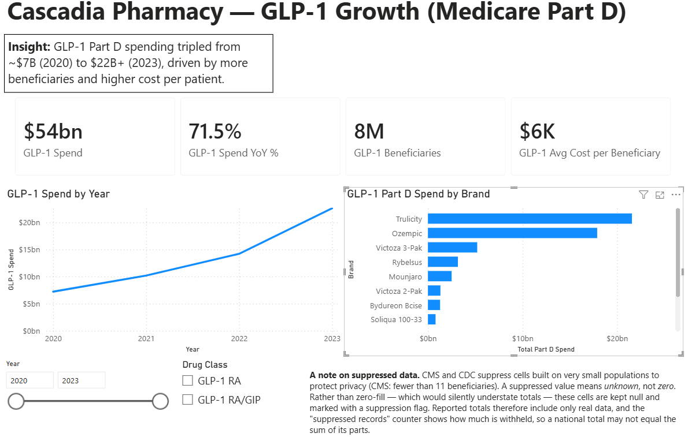

::: {.case-study-header}
::: {.cs-domain}
Healthcare / Pharmacy Analytics
:::
# Cascadia Pharmacy
::: {.cs-hook}
Turning messy federal public data — CMS Part D suppressed cells, CDC VaxView age-band mismatches — into a clean star schema and an interview-ready GLP-1 growth story.
:::
:::

---

## Overview

A pharmacy-growth analytics stack built on real public data — CMS Medicare Part D drug spending and CDC adult immunization coverage — applying the Cascadia approach to healthcare. It's also a deliberate showcase of cleaning messy, incomplete real-world data.

---

## Business Problem

Two of the biggest growth areas in retail pharmacy are GLP-1 medications and immunization services. Both questions — where is GLP-1 spend going, and where are the immunization coverage gaps — live in public datasets that are real, valuable, and genuinely messy.

---

## Architecture

**Local SQL Server star schema → Power BI** — a personal-scale build on public data, with no cloud lakehouse in the loop.

**Source layer:** CascadiaRx SQL Server star schema — 5 dimension tables + 2 fact tables.

- `fact_partd_drug_spend` (339 rows, grain: drug × year 2020–2024, CMS Part D data)
- `fact_immunization_coverage` (24,596 rows, grain: vaccine × geography × demographic × season, CDC VaxView)

**Staging:** a Python `raw → clean` layer — currency-string parsing, drug-name normalization, and suppression handling; suppressed values are flagged, never zero-filled.

**Semantic model + report:** Power BI — GLP-1 Growth Story page + Immunization Coverage & Access page (Phase 2, in build).

---

## Data Sources

| Source | Type | Rows | Notes |
|---|---|---|---|
| CMS Medicare Part D Spending by Drug | Federal (CMS) | 14,536 raw → 339 filtered | Wide-format CSV, 2020–2024 annual columns; filtered to antidiabetic/obesity drug classes |
| CDC FluVaxView | Federal (CDC / Socrata) | 100K raw → 24,596 filtered | Adult flu vaccination coverage by state × age × season |
| CDC RSVVaxView | Federal (CDC) | TBD | Adult RSV coverage — in progress (Phase 2) |
| CDC COVIDVaxView | Federal (CDC) | TBD | Adult COVID coverage — in progress (Phase 2) |

**Attribution:**
- CMS Part D data: [Centers for Medicare & Medicaid Services](https://data.cms.gov/summary-statistics-on-use-and-payments/medicare-medicaid-spending-by-drug/medicare-part-d-spending-by-drug) — public domain federal data.
- CDC VaxView: [Centers for Disease Control and Prevention](https://www.cdc.gov/vaccines/imz-managers/coverage/adultvaxview/index.html) — public domain federal data.

---

## Headline Skill: Cleaning Messy & Incomplete Data

Real government data isn't clean: CMS suppresses small-cell counts (blanks/asterisks), spend arrives as currency strings, drug names vary in casing, and CDC suppresses or flags unstable estimates for small samples. The pipeline preserves that reality and handles it honestly — suppressed values are flagged, never silently zero-filled — and the report surfaces a "suppressed records" counter so the audience understands why a national total doesn't equal the sum of states.

### Key Findings

- GLP-1 medications are the standout growth story in Medicare Part D: class spend roughly **tripled from ~$7B (2020) to $22B+ (2023)** — about **$54B cumulative** over 2020–2023, with the latest year up **~70% YoY**.
- The growth is driven by **both volume and cost** — more beneficiaries *and* rising cost per beneficiary, not just price increases. Trulicity and Ozempic lead the class.
- Immunization coverage gap analysis publishes with the Phase 2 Power BI report.

---

## The Report

*Walkthrough video coming soon. The Immunization Coverage & Access page publishes with Phase 2.*

---

## Tech Stack

SQL Server 2025
T-SQL
Python
CMS Part D Data
CDC VaxView
Power BI
DAX
PowerShell

---

## Links

- [Build Repository](https://github.com/RobbinsAnalytics/cascadia-pharmacy-analytics) — SQL DDL, Python acquisition/staging scripts, run_phase1.ps1
- [Domain Explainer](https://github.com/RobbinsAnalytics/cascadia-pharmacy-analytics/blob/main/docs/explainers/03_cascadia_pharmacy_domain.md) — schema decisions, messy-data showcase table, interview talking points
- [Cascadia Architecture Overview](../cascadia.qmd)
