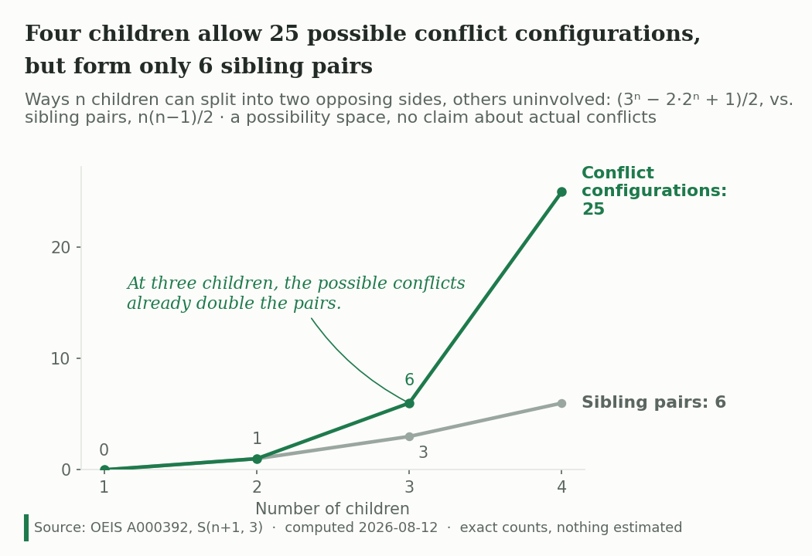

::: {.case-study-header}
::: {.cs-domain}
Mathematics · Preprint · Not a BI module
:::
# The Combinatorics of Sibling Conflict
::: {.cs-hook}
Everything else in this portfolio is a data build. This is not. It is a
~2,000-word mathematics paper with two figures and one table: no client, no
pipeline, no dashboard, no dataset. It counts a possibility space and says so.
:::
:::

[Read the Paper (PDF)](https://www.robbinsanalytics.com/assets/Robbins-Combinatorics-of-Sibling-Conflict.pdf){.btn .btn-primary}
[Repository](https://github.com/RobbinsAnalytics/cascadia-curiosities){.btn .btn-outline-secondary}

---

## Status — read this before the rest

**Preprint, under consideration at *The Mathematical Intelligencer*** (queried
2026-08-12, reply pending).

To be exact about what that means: a pre-submission query went to the journal's
co-editors-in-chief on 2026-08-12 with the compiled PDF attached, and the reply
is pending. Formal submission would follow a green light. The paper is **not
published, not accepted, and not peer-reviewed.** Nothing on this page should
be read as a publication credit.

The version linked above is the submitted manuscript. Springer's preprint policy
permits posting the submitted version on a personal site and does not treat it
as prior publication (verified 2026-08-12); it is disclosed at formal
submission.

---

## The question

I have four children, each two years apart. The number of distinct ways they
could get into a fight seemed never-ending, so I counted it.

Formally: a **conflict configuration** is an unordered pair of disjoint,
nonempty subsets of the n children — the two sides — with any remaining
children uninvolved. That third category matters. A child can be on side A, on
side B, or out of it entirely.

---

## The result

Each child is assigned to side A, side B, or neither, giving 3^n^ assignments.
Removing the assignments where either side is empty (2·2^n^ − 1, by
inclusion–exclusion) and halving, because the labels A and B are
interchangeable, leaves:

$$C(n) = \frac{3^n - 2 \cdot 2^n + 1}{2}$$

This is not an ad hoc expression. It equals **S(n+1, 3)**, a Stirling number of
the second kind — [OEIS A000392](https://oeis.org/A000392), where the sequence
is characterised as exactly this: the disjoint unions of two nonempty subsets of
an n-element set.

| Children | Sibling pairs, n(n−1)/2 | Conflict configurations |
|---:|---:|---:|
| 1 | 0 | 0 |
| 2 | 1 | 1 |
| 3 | 3 | 6 |
| 4 | 6 | 25 |
| 5 | 10 | 90 |
| 6 | 15 | 301 |
| 7 | 21 | 966 |
| 8 | 28 | 3,025 |

Four children form six sibling pairs but allow 25 conflict configurations.
Eight children form 28 pairs and allow 3,025. Pairs grow quadratically; the
conflict space grows exponentially, tracking 3^n^ — each additional child
roughly triples it.

```{=html}
<!-- Below 600px the design render (1050px wide, built for 7 inches of print)
     scales to ~324px and its in-chart type lands at 6-7 CSS px. The narrow
     render is the 3.6in single-column build and carries larger relative type.
     Both cleared the Rule 7.4 panels; chart-review.md records every seat
     reading both widths. -->
<div class="quarto-figure quarto-figure-center">
<figure class="figure">
<p><picture>
<source media="(max-width: 600px)" srcset="../assets/sibling-conflict-figureA-narrow.png">

</picture></p>
<figcaption>Figure A — the typical range, n = 1 to 4. At three children the six possible conflicts already double the three pairs.</figcaption>
</figure>
</div>
```

```{=html}
<!-- Same reasoning as Figure A. The annotation is described rather than quoted:
     the two renders word it differently ("triples the space of possible
     conflicts" / "triples the possibilities"), and alt applies to whichever
     source the browser picks. -->
<div class="quarto-figure quarto-figure-center">
<figure class="figure">
<p><picture>
<source media="(max-width: 600px)" srcset="../assets/sibling-conflict-figure1-narrow.png">

</picture></p>
<figcaption>Figure B — the full range, n = 1 to 8. The pairs line does not visibly leave the axis; the conflict line reaches 3,025.</figcaption>
</figure>
</div>
```

---

## What the paper does not claim

The formula counts a **possibility space**. It does not predict how often
siblings actually fight, how badly, or how any of it turns out. Many families
with a large theoretical conflict space stay close; some small families
fracture. The caveat is carried in the abstract, in Section 3, and on the face
of both figures, because a chart that travels without its paper needs to carry
its own limits.

It is also not a novelty claim over the whole field. Bossard (1945) counted
family relationships as n(n−1)/2, and Kephart (1950) extended that to
subgroupings. Both are cited in the paper, and the claim is narrowed
accordingly: this extends the Bossard–Kephart tradition to *opposing-sides*
configurations, and connects it to the coalition-structure-generation literature
in cooperative game theory. Adjacent formalism — three-way conflict analysis in
the Pawlak tradition — is noted and distinguished: it analyses a given conflict
rather than counting the space of them.

---

## How it was checked

- **Brute force.** All 3^n^ assignments enumerated for n = 1–8, both sides
  required nonempty, halved for label symmetry. Matches the closed form exactly:
  0, 1, 6, 25, 90, 301, 966, 3,025.
- **Closed form.** Cross-checked against OEIS A000392, whose listed formula
  a(n) = (1 + 3^n−1^ − 2^n^)/2 gives a(n+1) = (3^n^ − 2·2^n^ + 1)/2.
- **Prior art.** Searched before the novelty claim was written, then the claim
  was narrowed to fit what the search found rather than the reverse.
- **Citations.** Every reference vetted to source: Bossard, Kephart, Minuchin,
  Caplow, McHale et al., Bank & Kahn, Hank & Steinbach, Jensen et al., Rahwan
  et al., Sandholm et al., Lang et al.

---

## The figures went through the same review as the dashboards

This is the one thing the paper shares with the rest of the portfolio. Both
figures were built to Cascadia VIZ-PRINCIPLES v2.5 and scored against
CHART-REVIEW v2.5, including **two Rule 7.4 reading panels** — four blind
reviewers per round who see only the rendered chart, at two widths each, with an
editor, a quantitative family-studies researcher, a non-technical parent, and a
visualization seat.

The panels changed the figures. Round one produced twelve findings, ten of them
defects: the "each added child roughly triples it" annotation was asserted but
not checkable on the canvas, so value labels at n = 5, 6, 7 were added and the
tripling became verifiable by eye; the subtitle gained both "others uninvolved"
and the possibility-space caveat because two seats read a claim about real
families that the mathematics does not support. Round two ran after the artifact
changed to two figures and produced eight more defects — the non-technical seat
could not find a four-child family on a chart that started being readable at
five, which is why Figure A exists at all.

Three findings were rejected with reasons and five accepted as residual, each
recorded. The full disposition tables and panel returns are in the repository.

**One exception carries onto this page.** Both figures were typeset in DejaVu,
substituting for the brand's Source Serif 4 and Segoe UI, which were unavailable
in the build environment; the review recorded that they should be re-rendered
with brand fonts if reused on a Cascadia web property. They are shipped here
as-is deliberately — these are the exact files that cleared both panels, and
re-rendering them would produce charts no panel has read.

---

## Why it is in this portfolio

Because the standard is the same one. The paper states what it measures and
what it does not, cites the prior work that narrows its own claim, publishes the
review its figures failed and then passed, and describes its status precisely
rather than favourably. That is the through-line with every data build here —
it just happens to have no data.

---

## Disclosure

Independent work, no funding, no affiliation. Submitted-version preprint posted
under Springer's preprint policy (verified 2026-08-12). The formula is a
combinatorial identity; no human subjects, no dataset, and no empirical claim
about any family.

---

## Links

- [The Paper (PDF)](https://www.robbinsanalytics.com/assets/Robbins-Combinatorics-of-Sibling-Conflict.pdf) — the submitted manuscript, ~2,000 words, two figures, one table
- [Repository](https://github.com/RobbinsAnalytics/cascadia-curiosities) — manuscript source, figure build scripts, research record, chart review and both panel returns
- [OEIS A000392](https://oeis.org/A000392) — the sequence, S(n+1, 3)
- [Cascadia Architecture Overview](../cascadia.qmd)
